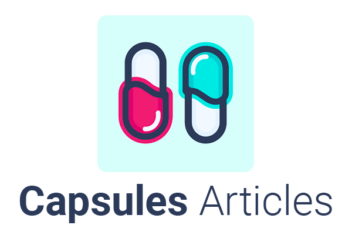

<p align="center"></p>


## About

Collect feedback via Slack notifications in your Laravel project.


## Installation

1. Install dependencies

```bash
commposer install

npm install
```

<br>

2. Create [Slack App](https://api.slack.com/apps?new_app=1) and add environment variable

```bash
cp .env.example .env

php artisan key:generate

LOG_SLACK_WEBHOOK_URL=https://hooks.slack.com/services/{your-webhook-key}
```

<br>

3. Link your project with Laravel Valet

```bash
valet link article
```

<br>

4. Run development server script

```bash
npm run dev
```

<br>

5. Visit your website : http://article.test
