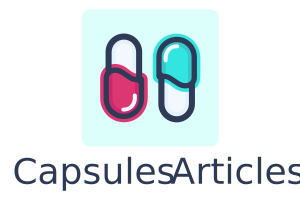

<p align="center"></p>


## About

Here are stored the projects examples linked with <a href="https://capsules.codes/en/blog">Capsules articles</a>.
Inviting readers to try out the articles content by themselves.

<br>

## Articles

- [ Make your own artisan ](https://github.com/capsulescodes/articles/tree/001-make-your-own-artisan)
- [ Make a custom 502 page ](https://github.com/capsulescodes/articles/tree/002-make-a-custom-502-page)
- [ Use several databases within your Laravel project ](https://github.com/capsulescodes/articles/tree/003-use-several-databases-within-your-laravel-project)
- [ Add a global dark mode with Tailwind CSS ](https://github.com/capsulescodes/articles/tree/004-add-a-global-dark-mode-with-tailwindcss)
- [ Display a modal using Vue Teleport component ](https://github.com/capsulescodes/articles/tree/005-display-a-modal-using-vue-teleport-component)
- [ Build a Laravel blog using Vue and Canvas ](https://github.com/capsulescodes/articles/tree/006-build-a-laravel-blog-using-vue-and-canvas)
- [ Modify tables and records with Laravel Population ](https://github.com/capsulescodes/articles/tree/007-modify-tables-and-records-with-laravel-population)
- [ Create a Laravel package on your local environment ](https://github.com/capsulescodes/articles/tree/008-create-a-laravel-package-on-your-local-environment)
- [ Organize Laravel tools on a unique subdomain ](https://github.com/capsulescodes/articles/tree/009-organize-laravel-tools-on-a-unique-subdomain)
- [ Collect feedback via Slack notifications in your Laravel project ](https://github.com/capsulescodes/articles/tree/010-collect-feedback-via-slack-notifications-in-your-laravel-project)
- [ Implement a translation system in your Laravel Vue project ](https://github.com/capsulescodes/articles/tree/011-implement-a-translation-system-in-your-laravel-vue-project)
- [ Run Laravel on your browser with Browser PHP ](https://github.com/capsulescodes/articles/tree/012-run-laravel-on-your-browser-with-browser-php)
- [ Create a Node package on your local Laravel environment ](https://github.com/capsulescodes/articles/tree/013-create-a-node-package-on-your-local-laravel-environment)
- [ Draw a dynamic SVG pattern with Vue ](https://github.com/capsulescodes/articles/tree/014-draw-a-dynamic-svg-pattern-with-vue)
- [ Collect feedback via Discord notifications in your Laravel project ](https://github.com/capsulescodes/articles/tree/015-collect-feedback-via-discord-notifications-in-your-laravel-project)
- [ Create a custom error page with Laravel and Inertia ](https://github.com/capsulescodes/articles/tree/016-create-a-custom-error-page-with-laravel-and-inertia)
- [ Craft emails with Vue and Tailwind using Inertia Mailable ](https://github.com/capsulescodes/articles/tree/017-craft-emails-with-vue-and-tailwind-using-inertia-mailable)

<br>

## Installation

1. Clone the repository

```bash
git clone https://github.com/capsulescodes/articles.git
```

<br>

2. Navigate to directory

```bash
cd articles
```

<br>

3. Follow the instructions in article related branch `README` file
